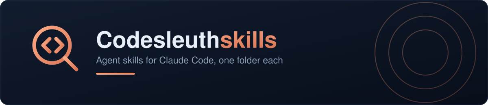

Agent skills for [Claude Code](https://claude.com/claude-code). Each one is a self-contained
folder: instructions in `SKILL.md`, plus any scripts and reference material it needs.

## Skills

| Skill | What it does |
|---|---|
| [`apply-pr-feedback`](skills/apply-pr-feedback) | Applies GitHub PR review feedback end to end — fixes the unambiguous comments one commit each, pushes, drives CI to green, then replies with the commit hash and resolves the thread. Judgment calls are collected into a summary instead of being acted on. |
| [`review-pr`](skills/review-pr) | Reviews a GitHub pull request against the whole codebase rather than the diff alone, then publishes it as one review — inline comments on the lines they're about, plus a summary that approves, comments, or requests changes. Reads the code; never runs it or changes it. |

## Installing

Clone the repository, then symlink the skills you want. A symlink means `git pull` updates
the skill in place — with a copy you'd have to remember to re-copy it.

```bash
git clone https://github.com/Codesleuth/skills.git ~/src/codesleuth-skills

# available everywhere
mkdir -p ~/.claude/skills
ln -s ~/src/codesleuth-skills/skills/apply-pr-feedback ~/.claude/skills/apply-pr-feedback

# or just in one project
ln -s ~/src/codesleuth-skills/skills/apply-pr-feedback /path/to/project/.claude/skills/apply-pr-feedback
```

Give `ln -s` an absolute path for the target — a relative one is resolved from the link's
own directory, not from where you ran the command.

Claude picks it up on the next session. You don't invoke a skill by name — ask for what you
want in plain language and the matching skill triggers. Each skill's README covers the tools
it needs and what it will and won't do.

## Contributing

Contributions are welcome, with one condition: they must be free of any license obligation
and donated outright. Read [CONTRIBUTING.md](CONTRIBUTING.md) before opening a pull request.

## License

[MIT](LICENSE) — © 2026 David Wood. One license for the whole repository; skills do not carry
their own.
